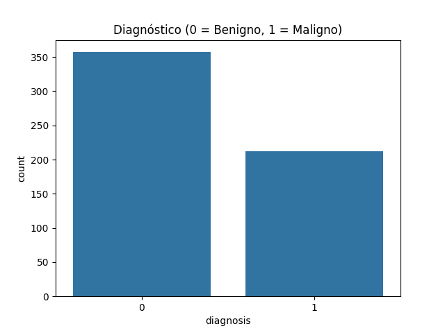
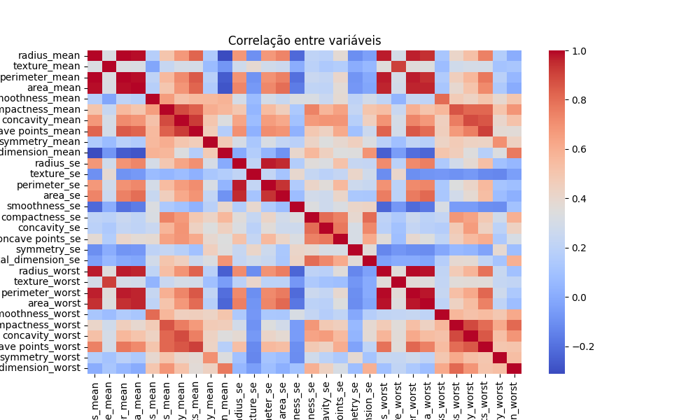
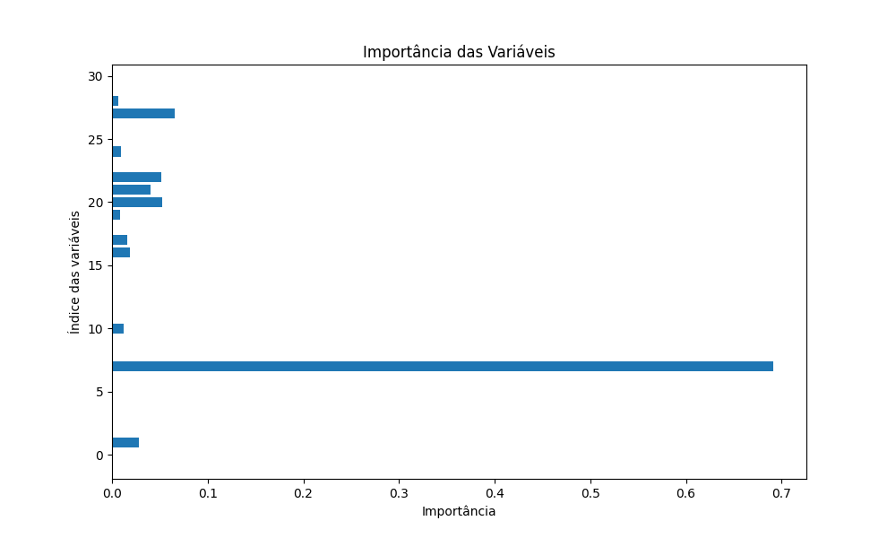
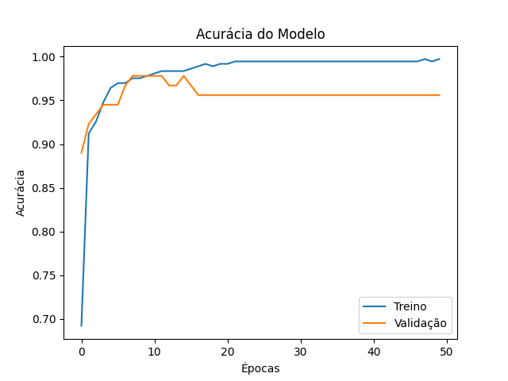

# 📊 Análise Exploratória e Interpretabilidade dos Dados

## 📌 Distribuição do Diagnóstico

O gráfico de distribuição do diagnóstico apresenta a quantidade de amostras classificadas como:

- **0 (Benigno)**
- **1 (Maligno)**

Observa-se que há um **maior número de casos benignos em relação aos malignos**, indicando um leve desbalanceamento no dataset.

Esse fator é importante pois pode influenciar o desempenho do modelo, tornando necessário o uso de métricas além da acurácia, como:

- Precision  
- Recall  
- F1-score  

---

## 🔍 Correlação entre Variáveis

A matriz de correlação evidencia o grau de relação entre as variáveis do dataset.

### Principais observações:

- Variáveis como **radius_mean, perimeter_mean e area_mean** apresentam **alta correlação positiva**
- Isso indica possível **redundância de informação**
- Algumas variáveis possuem correlação moderada com o diagnóstico, contribuindo para a predição

### Importância dessa análise:

- Entender dependência entre variáveis  
- Evitar multicolinearidade  
- Melhorar a interpretabilidade do modelo  

---

## 🧠 Importância das Variáveis

O gráfico de importância das variáveis, gerado a partir do modelo de árvore de decisão, mostra quais atributos mais influenciam na classificação.

### Observações relevantes:

- Uma variável se destaca significativamente com maior peso na decisão do modelo  
- Isso indica que o modelo utiliza fortemente essa característica para classificar tumores  
- Outras variáveis possuem menor impacto individual, mas ainda contribuem no conjunto  

### Benefícios dessa análise:

- Entender como o modelo toma decisões  
- Identificar quais características clínicas são mais relevantes  
- Aumentar a transparência do modelo (explicabilidade)
---

---

## 📈  Acurâcia do Modelo

O gráfico apresentado ilustra a evolução da acurácia de um modelo de aprendizado de máquina ao longo das épocas de treinamento, comparando o desempenho nos conjuntos de treino e validação.

Observa-se que, nas primeiras épocas, a acurácia de treino cresce rapidamente, saindo de aproximadamente 0,69 para valores acima de 0,95 em poucas iterações. Esse comportamento indica que o modelo está aprendendo padrões relevantes dos dados de forma eficiente. A partir de cerca da 10ª época, a acurácia de treino continua aumentando gradualmente até se aproximar de 1,00, sugerindo um ajuste quase perfeito aos dados de treinamento.

Por outro lado, a acurácia de validação também apresenta crescimento inicial, atingindo valores próximos de 0,97–0,98, o que demonstra boa capacidade de generalização no início do processo. No entanto, após esse ponto, a métrica de validação se estabiliza e até apresenta pequenas oscilações, mantendo-se em torno de 0,95–0,96.

Essa divergência entre as curvas  com a acurácia de treino continuando a subir enquanto a de validação se mantém estável ou ligeiramente inferior  é um indicativo clássico de overfitting. Ou seja, o modelo está se ajustando excessivamente aos dados de treinamento, capturando inclusive ruídos, o que não se traduz em melhoria no desempenho sobre dados não vistos.

Em termos práticos, isso sugere que o ponto ideal de treinamento pode estar nas primeiras épocas em que a acurácia de validação atinge seu pico. Estratégias como early stopping, regularização (L1/L2), dropout ou aumento da base de dados podem ser aplicadas para melhorar a capacidade de generalização do modelo.

Em resumo, o modelo apresenta excelente desempenho no treino, mas há sinais claros de sobreajuste, indicando a necessidade de ajustes para garantir maior robustez em cenários reais.

---

##  Conclusão da Análise

A análise exploratória demonstrou que:

- O dataset possui leve desbalanceamento  
- Existem variáveis altamente correlacionadas  
- Algumas características têm forte influência na classificação  

Esses fatores reforçam a importância do pré-processamento e da escolha adequada dos modelos, garantindo melhores resultados na predição de câncer de mama.